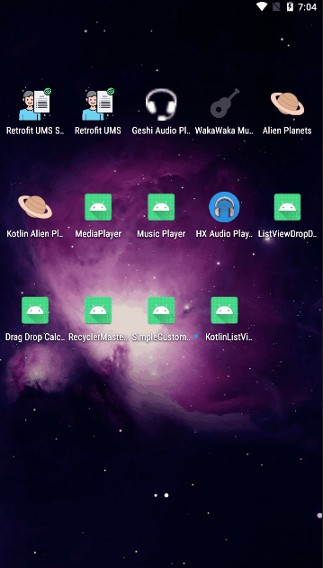

# KotlinListViewFilter
Filter listview using dropdwon in kotlin. Kotlin Absolute beginners series.

Find complete tutorial at [Camposha here](https://camposha.info/kotlin-android-filtering-using-dropdown-spinner/).

Contact Me: oclemmi@gmail.com

My website: [Camposha](https://camposha.info)

YouTube: [ProgrammingWizards TV](https://youtube.com/c/programmingwizards)
